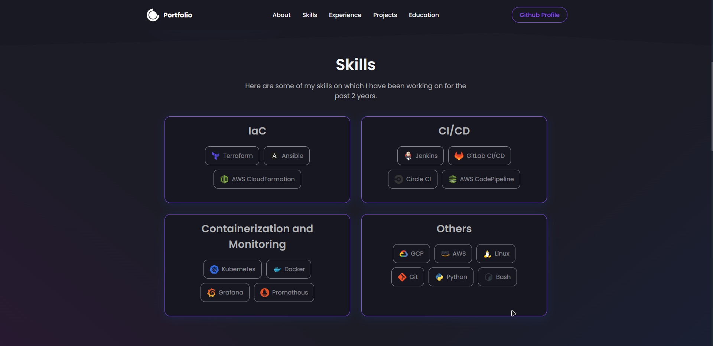
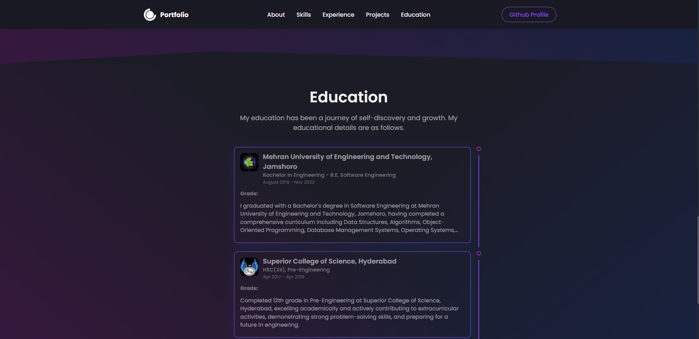
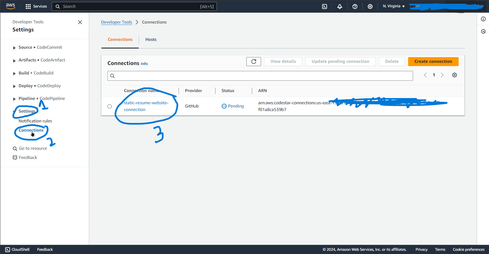
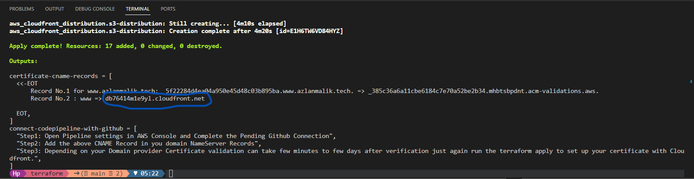
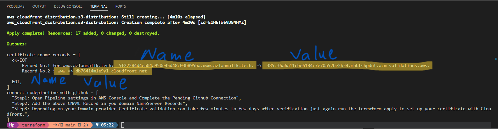
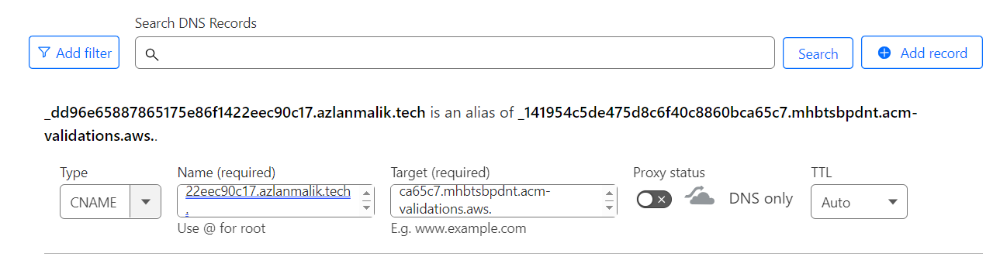

<a name="readme-top"></a>

[![MIT License][license-shield]][license-url]
[![LinkedIn][linkedin-shield]][linkedin-url]


## Weblink: [Live Website](https://www.azlanmalik.tech)

<!-- webiste images -->






<!-- TABLE OF CONTENTS -->
## Table of Contents
- [Introduction](#introduction)
- [Technologies Used](#technology-used)
- [Getting Started](#getting-started)
- [Run Website Locally](#to-run-website-locally)
- [Deploy Website on AWS](#to-deploy-and-run-website-on-aws)
- [License](#license)
- [Acknowledgements](#Acknowledgments)


<!-- ABOUT THE PROJECT -->

## Introduction

This project showcases the deployment of a `React website` as a static site on AWS S3, prioritizing both performance and security. The website leverages the scalability and cost-effectiveness of `S3`, while `CloudFront` serves as a CDN for fast global access and reduced latency. Additionally, an HTTPS connection ensures secure data transmission.

But that's not all. To streamline the deployment process and eliminate manual intervention, I crafted an automated CI/CD pipeline using AWS services. `GitHub` serves as the secure repository for application code, triggering automated builds and tests with `CodeBuild` upon any changes. `CodeDeploy` then seamlessly updates the live site hosted on S3, while `CodePipeline` orchestrates the entire flow, ensuring smooth delivery.

Furthermore, I have used `Terraform`, an Infrastructure as Code tool, to automate the provisioning of all infrastructure with just a single click. This approach provides flexibility, maintainability, and reproducibility, as the entire infrastructure configuration is documented and version-controlled.

<p align="right">(<a href="#top">back to top</a>)</p>

## Technology Used
### Built With:

- [React.js](https://reactjs.org/)

### Deployed Using:

- [Terraform](https://aws.amazon.com/codecommit/)
- [AWS CodeBuild](https://aws.amazon.com/codebuild/)
- [AWS CodePipeline](https://aws.amazon.com/code/)

### Deployed On:

- [AWS S3](https://aws.amazon.com/s3/)
- [AWS Cloudfront](https://aws.amazon.com/cloudfront/)

<p align="right">(<a href="#top">back to top</a>)</p>

<!-- GETTING STARTED -->

# Getting Started

## To Run Website Locally

### Prerequisites

To run this project you must have Node installed on your machine. If you do not have Node.js then just visit the link given and download Node for your device.

- [Node.js](https://nodejs.org/en/download/)

### Installation

1. Clone the repository:

```sh
git clone https://github.com/azlanmalik/static-resume-on-s3.git
```

2. Install the dependencies:

```sh
npm install
```

3. Start the development server:

```sh
npm start
```

4. Open your browser and visit:

```sh
http://localhost:3000
```

<p align="right">(<a href="#top">back to top</a>)</p>

## To Deploy and Run Website on AWS

### Prerequisites

To run this project you must have Terraform and AWS Cli installed and configured on your system.

- [Terraform](https://nodejs.org/en/download/)
- [AWS Cli](https://nodejs.org/en/download/)
- [AWS Account](https://aws.amazon.com/)

Optional: 
- Having a Domain Name is Recommended but not Necessary.

### Deploying Process

1. Fork the repository:
  ```sh
  https://github.com/AzlanMalik/static-resume-on-s3
  ```

2. Clone the repository from your github account
```sh
  git clone <your-repo-url>
```

3. Open the Cloned Repo in any Code Editor and change the `src/data/constants.js` with your information

4. Then in Terraform Folder Create a file named `Terraform.tfvars` and copy the text below in it
```sh
aws-region          = "us-east-1" #Don't change it because AWS CodeStar service is only present on specific regions
branch              = "main" 
project-name        = ""
domain-name         = ""
github-repo         = ""
git-owner           = ""
git-repo            = ""
codepipeline-bucket = "" #Write a unique name because on AWS there can't be two buckets of same name
```

5. Now Add your values in them

6. `cd Terraform` and Run these commands
```sh
terraform init
terraform apply --auto-approve
```
output would be like this:


7. Open AWS Console and search for Codepipeline then click on setting approve the github pending request



Copy and Paste this Url in browser your website is live!


## Optional: If you want to use your Custom Domain

8. Then Copy Both CNAME Records Values from the terminal and Add them to your domain NameServer:
Output in Terminal:


Add your Records like this:



9. Lastly after few minutes again run this command in terraform Folder
```sh
terraform apply --auto-approve
```

Congrats Your Website is live! Check your Domain

<p align="right">(<a href="#top">back to top</a>)</p>

<!-- LICENSE -->

## License

Distributed under the MIT License. See `LICENSE.txt` for more information.

<p align="right">(<a href="#top">back to top</a>)</p>

<!-- CONTACT -->

## Contact

Azlan Malik - [@azlanmalik](https://linkedin.com/in/azlanmalik) - hello@azlanmalik.tech

Project Link: [https://github.com/azlanmalik/static-resume-on-s3](https://github.com/azlanmalik/static-resume-on-s3)

<p align="right">(<a href="#top">back to top</a>)</p>

<!-- ACKNOWLEDGMENTS -->

## Acknowledgments

The Website React Code is written by

- [Rishav Chandra](https://github.com/rishavchanda/rishavchanda.github.io)

<p align="right">(<a href="#top">back to top</a>)</p>

<!-- MARKDOWN LINKS & IMAGES -->
<!-- https://www.markdownguide.org/basic-syntax/#reference-style-links -->

[contributors-shield]: https://img.shields.io/github/contributors/azlanmalik/static-resume-on-s3.svg?style=for-the-badge
[contributors-url]: https://github.com/azlanmalik/static-resume-on-s3/graphs/contributors
[forks-shield]: https://img.shields.io/github/forks/azlanmalik/static-resume-on-s3.svg?style=for-the-badge
[forks-url]: https://github.com/azlanmalik/static-resume-on-s3/network/members
[stars-shield]: https://img.shields.io/github/stars/azlanmalik/static-resume-on-s3.svg?style=for-the-badge
[stars-url]: https://github.com/azlanmalik/static-resume-on-s3/stargazers
[issues-shield]: https://img.shields.io/github/issues/azlanmalik/static-resume-on-s3.svg?style=for-the-badge
[issues-url]: https://github.com/azlanmalik/static-resume-on-s3/issues
[license-shield]: https://img.shields.io/github/license/azlanmalik/static-resume-on-s3.svg?style=for-the-badge
[license-url]: https://github.com/azlanmalik/static-resume-on-s3/blob/master/LICENSE.txt
[linkedin-shield]: https://img.shields.io/badge/-LinkedIn-black.svg?style=for-the-badge&logo=linkedin&colorB=555
[linkedin-url]: https://linkedin.com/in/azlanmalik
[product-screenshot]: images/screenshot.png
