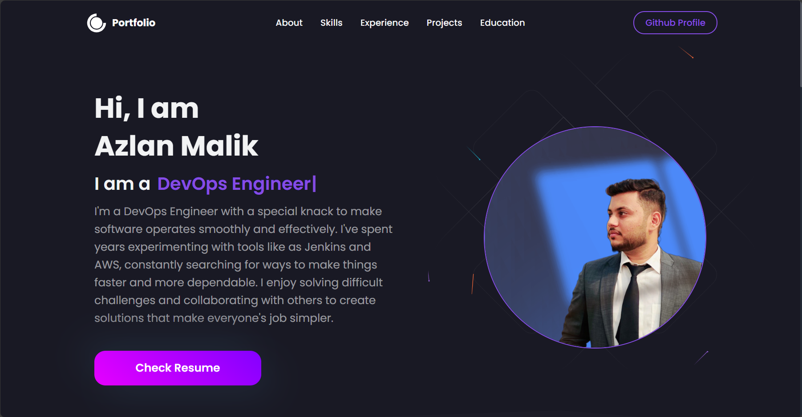

<a name="readme-top"></a>

[![MIT License][license-shield]][license-url]
[![LinkedIn][linkedin-shield]][linkedin-url]

<!-- webiste images -->




<!-- TABLE OF CONTENTS -->
<details>
  <summary>Table of Contents</summary>
  <ol>
    <li>
      <a href="#about-the-project">About The Project</a>
      <ul>
        <li><a href="#built-with">Built With</a></li>
      </ul>
    </li>
    <li>
      <a href="#getting-started">Getting Started</a>
      <ul>
        <li><a href="#prerequisites">Prerequisites</a></li>
        <li><a href="#installation">Installation</a></li>
      </ul>
    </li>
    <li><a href="#usage">Usage</a></li>
    <li><a href="#roadmap">Roadmap</a></li>
    <li><a href="#contributing">Contributing</a></li>
    <li><a href="#license">License</a></li>
    <li><a href="#contact">Contact</a></li>
    <li><a href="#acknowledgments">Acknowledgments</a></li>
  </ol>
</details>

<!-- ABOUT THE PROJECT -->

## About The Project

This project showcases the deployment of a `React website` as a static site on AWS S3, prioritizing both performance and security. The website leverages the scalability and cost-effectiveness of `S3`, while `CloudFront` serves as a CDN for fast global access and reduced latency. Additionally, an HTTPS connection ensures secure data transmission.

But that's not all. To streamline the deployment process and eliminate manual intervention, I crafted an automated CI/CD pipeline using AWS services. `GitHub` serves as the secure repository for application code, triggering automated builds and tests with `CodeBuild` upon any changes. `CodeDeploy` then seamlessly updates the live site hosted on S3, while `CodePipeline` orchestrates the entire flow, ensuring smooth delivery.

Furthermore, I have used `Terraform`, an Infrastructure as Code tool, to automate the provisioning of all infrastructure with just a single click. This approach provides flexibility, maintainability, and reproducibility, as the entire infrastructure configuration is documented and version-controlled.

<p align="right">(<a href="#top">back to top</a>)</p>

### Built With:

- [React.js](https://reactjs.org/)

### Deployed Using:

- [Terraform](https://aws.amazon.com/codecommit/)
- [AWS CodeBuild](https://aws.amazon.com/codebuild/)
- [AWS CodePipeline](https://aws.amazon.com/code/)

### Deployed On:

- [AWS S3](https://aws.amazon.com/s3/)
- [AWS Cloudfront](https://aws.amazon.com/cloudfront/)

<p align="right">(<a href="#top">back to top</a>)</p>

<!-- GETTING STARTED -->

## Getting Started

## To Run Website Locally

### Prerequisites

To run this project you must have Node installed on your machine. If you do not have Node.js then just visit the link given and download Node for your device.

- [Node.js](https://nodejs.org/en/download/)

### Installation

1. Clone the repository:

```sh
git clone https://github.com/azlanmalik/github_repo.git
```

2. Navigate to the project directory:

```sh
cd react-portfolio
```

3. Install the dependencies:

```sh
npm install
```

4. Start the development server:

```sh
npm start
```

5. Open your browser and visit:

```sh
http://localhost:3000
```

<p align="right">(<a href="#top">back to top</a>)</p>

## To Deploy and Run Website on AWS

### Prerequisites

To run this project you must have Terraform and AWS Cli on your system.

- [Terraform](https://nodejs.org/en/download/)
- [AWS Cli](https://nodejs.org/en/download/)

### Deploying Process

1. Fork the repository:

2. Clone the repository from your github account

3. Open Terminal and Move to Terraform Directory

4. Run these commands
```sh
terraform init
terraform apply --auto-approve
```

5. Then Copy the CNAME Records Values from the terminal and Add them to your domain NameServer

6. Open AWS Console and link the Codepipeline to your Github 


<p align="right">(<a href="#top">back to top</a>)</p>

<!-- LICENSE -->

## License

Distributed under the MIT License. See `LICENSE.txt` for more information.

<p align="right">(<a href="#top">back to top</a>)</p>

<!-- CONTACT -->

## Contact

Azlan Malik - [@azlanmalik](https://linkedin.com/in/azlanmalik) - hello@azlanmalik.tech

Project Link: [https://github.com/azlanmalik/static-resume-on-s3](https://github.com/azlanmalik/static-resume-on-s3)

<p align="right">(<a href="#top">back to top</a>)</p>

<!-- ACKNOWLEDGMENTS -->

## Acknowledgments

The Website React Code is written by

- [Rishav Chandra](https://github.com/rishavchanda/rishavchanda.github.io)

<p align="right">(<a href="#top">back to top</a>)</p>

<!-- MARKDOWN LINKS & IMAGES -->
<!-- https://www.markdownguide.org/basic-syntax/#reference-style-links -->

[contributors-shield]: https://img.shields.io/github/contributors/azlanmalik/static-resume-on-s3.svg?style=for-the-badge
[contributors-url]: https://github.com/azlanmalik/static-resume-on-s3/graphs/contributors
[forks-shield]: https://img.shields.io/github/forks/azlanmalik/static-resume-on-s3.svg?style=for-the-badge
[forks-url]: https://github.com/azlanmalik/static-resume-on-s3/network/members
[stars-shield]: https://img.shields.io/github/stars/azlanmalik/static-resume-on-s3.svg?style=for-the-badge
[stars-url]: https://github.com/azlanmalik/static-resume-on-s3/stargazers
[issues-shield]: https://img.shields.io/github/issues/azlanmalik/static-resume-on-s3.svg?style=for-the-badge
[issues-url]: https://github.com/azlanmalik/static-resume-on-s3/issues
[license-shield]: https://img.shields.io/github/license/azlanmalik/static-resume-on-s3.svg?style=for-the-badge
[license-url]: https://github.com/azlanmalik/static-resume-on-s3/blob/master/LICENSE.txt
[linkedin-shield]: https://img.shields.io/badge/-LinkedIn-black.svg?style=for-the-badge&logo=linkedin&colorB=555
[linkedin-url]: https://linkedin.com/in/azlanmalik
[product-screenshot]: images/screenshot.png
